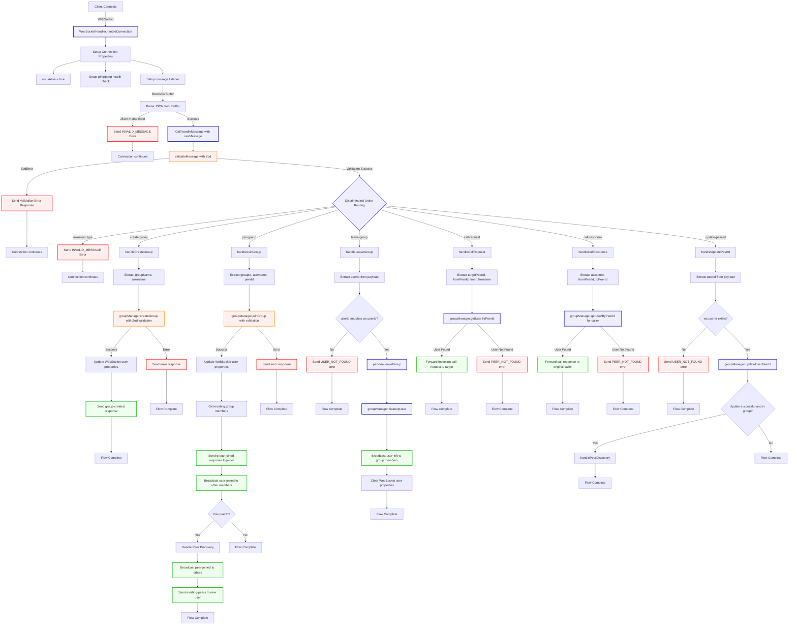
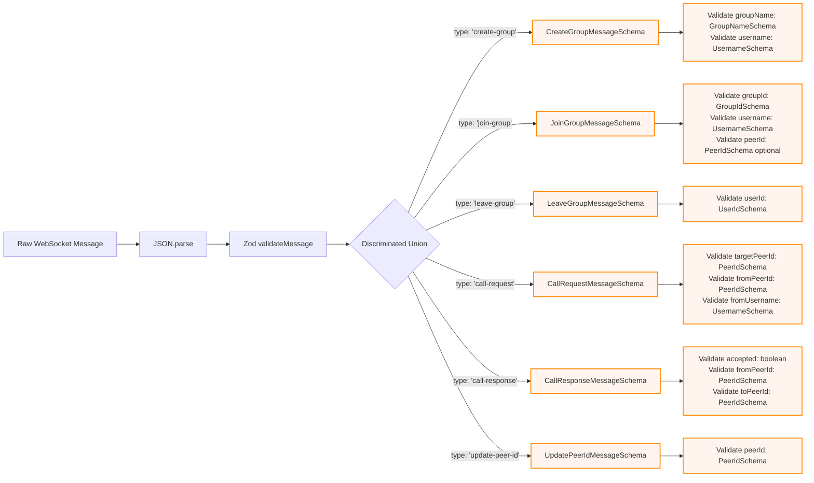
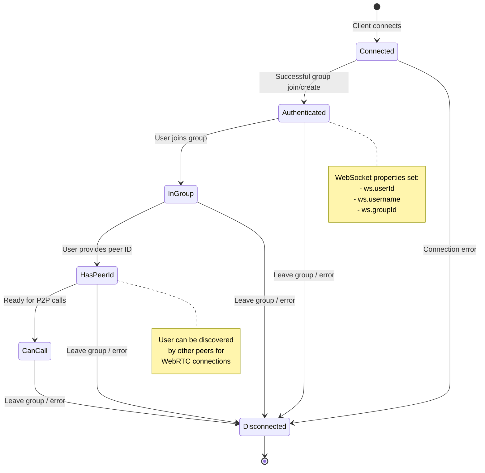
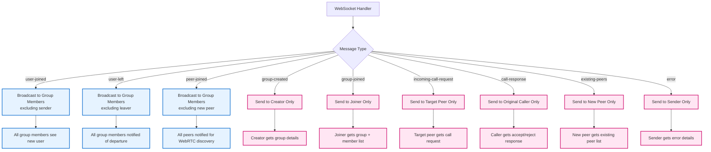
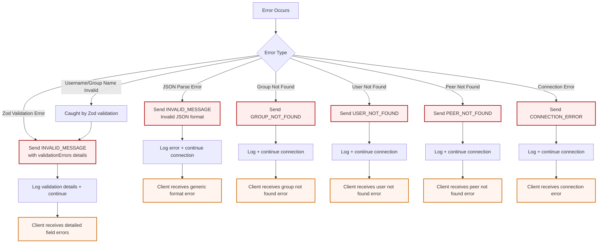

# PeerShare WebSocket Message Flow

## Complete WebSocket Message Processing Flow



## Message Type Validation Schemas



## WebSocket Connection Lifecycle



## Message Broadcasting Patterns



## Error Handling Flow



## Key Features Demonstrated

1. **Runtime Type Safety**: All messages validated with Zod before processing
2. **Discriminated Union Routing**: Message type determines validation schema and handler
3. **Input Sanitization**: Automatic trimming and format validation
4. **Comprehensive Error Handling**: Different error types with detailed responses
5. **Broadcasting Patterns**: Selective message delivery based on context
6. **Connection Lifecycle**: State management from connection to disconnection
7. **Peer Discovery**: WebRTC peer management for P2P connections

## Message Examples

### Valid Create Group Message
```json
{
  "type": "create-group",
  "payload": {
    "groupName": "My Team Meeting",
    "username": "john_doe"
  }
}
```

### Validation Error Response
```json
{
  "type": "error",
  "payload": {
    "code": "INVALID_MESSAGE",
    "message": "Invalid message format",
    "details": {
      "validationErrors": [
        {
          "code": "too_small",
          "minimum": 1,
          "type": "string",
          "inclusive": true,
          "exact": false,
          "message": "Username cannot be empty",
          "path": ["payload", "username"]
        }
      ]
    }
  },
  "timestamp": 1642781234567
}
```
