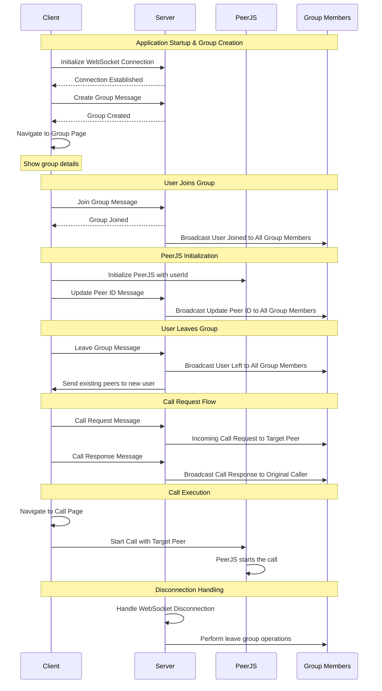
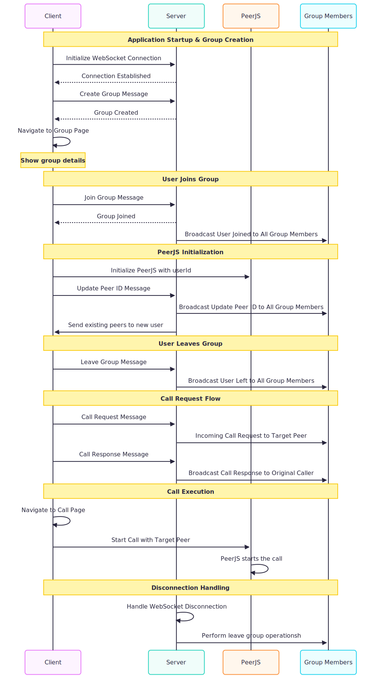

# App Flow Diagram

This diagram illustrates the complete application flow based on the AppFlow.md specification.

## Flow Description

### 1. **Application Startup**
- Client initializes WebSocket connection
- Server confirms connection establishment
- Client creates a group and receives confirmation

### 2. **Group Management**
- Client joins the group
- Server broadcasts user joined event to all group members
- Client initializes PeerJS with a unique userId
- Server broadcasts peer ID updates to all group members

### 3. **Call Management**
- Client sends call request to server
- Server forwards call request to target peer
- Client responds to call request
- Server broadcasts call response to original caller

### 4. **Call Execution**
- Client navigates to call page
- Client initiates call using PeerJS
- Direct peer-to-peer communication begins

### 5. **Disconnection Handling**
- Server monitors WebSocket connections
- Automatically performs leave group operations on disconnection
- Maintains group state consistency

## Key Components

- **Client**: Frontend application handling UI and user interactions
- **Server**: WebSocket server managing group state and message routing
- **PeerJS**: WebRTC library for peer-to-peer communication
- **Group Members**: Other clients in the same group

## Message Types

1. **Connection Messages**: WebSocket initialization and confirmation
2. **Group Messages**: Create, join, leave group operations
3. **Peer Messages**: Peer ID updates and synchronization
4. **Call Messages**: Call requests, responses, and management
5. **Broadcast Messages**: Server-to-multiple-clients notifications
